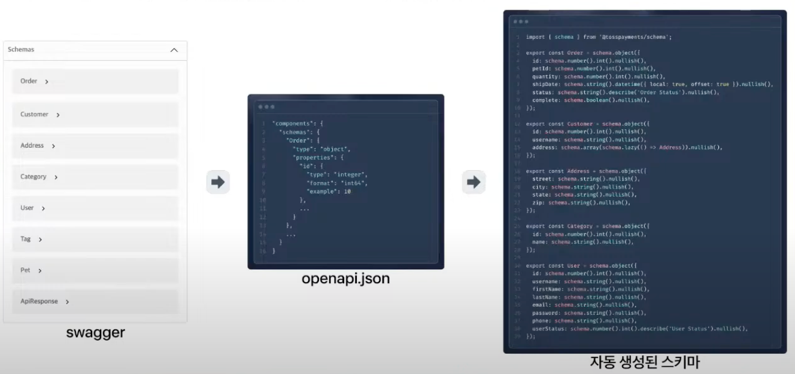

# OpenAPI Type Schema Test Automation

OpenAPI를 사용해 DTO 스키마를 타입스크립트 파일로 자동 생성하면, 타입 에러를 효과적으로 해결할 수 있습니다.
API, Query, Mutation 타입까지 자동으로 생성할 수 있어 개발 편의성이 크게 향상됩니다.

1. api client 생성 없이 스펙 정보만 자동 생성
2. zod로 요청 파라미터와 응답 데이터 파싱
3. 커스텀 transform 조건 주입
4. zero config로 원하는 결과물 생성

###  

- swagger-parser, openapi-types
- openapi-jsonschema-parameters
- json-schema-to-zod
- handlebars
- clipanion

### process

1. swagger docs url로부터 openapi spec 객체를 생성
2. spec.components로부터 request body와 response에 대한 zod schema 생성
3. spec.paths로부터 api endpoint 등 스펙을 원하는 객체 형태로 가공
4. 가공된 객체를 ts 파일로 변환

.png)